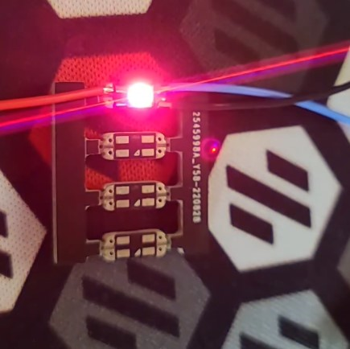

# Neopixel Sequin Board
10mm x 4mm Neopixel board

## Overview
This is a neopixel board in the same form factor as an Adafruit Sequin LED.

### Setup
To use, fold the legs of the SK6812MINI as shown below.

You want to end up with your LED looking like the one on the right

## BOM

| Reference | Description  |    Note    | Quantity |   LCSC   |
|   :---:   |     :---:    |   :---:    |  :---:   |  :---:   |
|    D1     |    SK6812    | SK6812MINI |     1    | C524051  |

