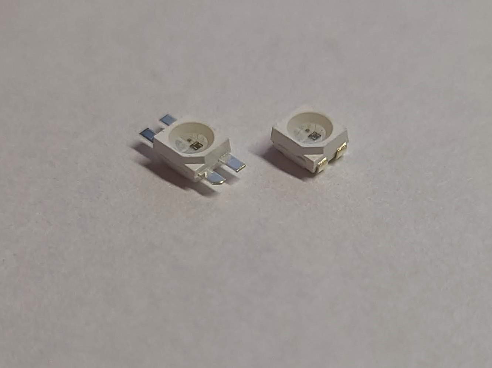

# Neopixel Sequin Board
10mm x 4mm Neopixel board

## Overview
This is a neopixel board in the same form factor as an Adafruit Sequin LED.

### Setup
To use, fold the legs of the SK6812MINI as shown below.

You want to end up with your LED looking like the one on the right.

Line up the notched corner of the LED with the marking on the PCB, Solder all 4 legs and add thin wires to the front side for control.

## BOM

| Reference | Description  |    Note    | Quantity |   LCSC   |
|   :---:   |     :---:    |   :---:    |  :---:   |  :---:   |
|    D1     |    SK6812    | SK6812MINI |     1    | C524051  |
